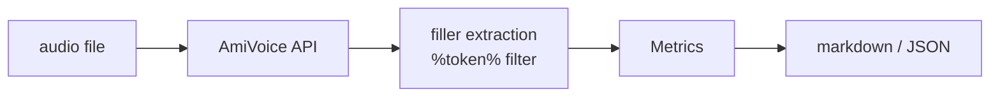
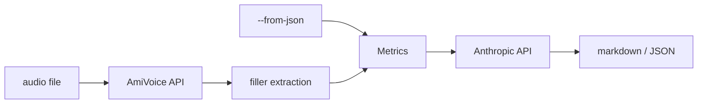

# filler-cli

Analyze filler words in Japanese speech using the AmiVoice speech recognition API.

## Installation

### go install

Requires Go 1.26 or later.

```bash
go install github.com/maro114510/filler-cli@latest
```

### Binary download

Pre-built binaries for Linux, macOS (Intel/Apple Silicon), and Windows are available on the [Releases page](https://github.com/maro114510/filler-cli/releases).

## API Keys

### AmiVoice API key

Required by `analyze` and `coach`. Obtain from the [AmiVoice Cloud Console](https://acp.amivoice.com/main/register/).

> **Note:** Use a standard (non-End-to-End) engine. End-to-End engines suppress filler tokens and produce zero filler events.

The CLI resolves your key in this order:

1. **`AMIVOICE_API_KEY`** environment variable
2. **`AMIVOICE_SERVICE_ID` + `AMIVOICE_SERVICE_PASSWORD`** — issues a one-time key valid for 2 hours (useful for CI)
3. **Interactive prompt** — prompted once, cached in `~/.config/filler-cli/credentials.json` for 2 hours

### LLM API key (`coach` only)

Set `LLM_API_KEY` to an [Anthropic API key](https://console.anthropic.com/).

```bash
export LLM_API_KEY=sk-ant-...
```

## Quickstart

```bash
export AMIVOICE_API_KEY=your_key_here
filler-cli analyze speech.wav
```

```
# Filler Analysis: speech.wav

## Estimated Speech Duration

92.3 s

## Total Fillers

7

## Fillers per Minute

4.55

## Filler Breakdown

| Filler | Count |
|--------|-------|
| えーと | 4 |
| あのー | 3 |

## Filler Event Timeline

| Filler | Start (ms) | End (ms) | Confidence |
|--------|-----------|---------|------------|
| えーと | 3120 | 3890 | 0.95 |
| あのー | 8440 | 9200 | 0.91 |
```

## Commands

### analyze

```
filler-cli analyze [flags] <audio-file>
```

Transcribes the audio file with AmiVoice and reports filler words found.

**Supported formats:** `.wav`, `.mp3`

**Flags:**

| Flag | Default | Description |
|------|---------|-------------|
| `--format` | `markdown` | Output format: `json` or `markdown` |
| `--output` | *(stdout)* | Write output to a file instead of stdout |
| `--keep-filler-token` | `1` | Pass `keepFillerToken` to AmiVoice (`0` or `1`). Set to `1` to detect fillers. |

**JSON output:**

```bash
filler-cli analyze --format json speech.wav
```

```json
{
  "audioFile": "speech.wav",
  "durationSec": 92.3,
  "generatedAt": "2026-06-06T10:00:00Z",
  "totalFillers": 7,
  "fillersPerMinute": 4.55,
  "breakdown": { "えーと": 4, "あのー": 3 },
  "firstFillerTimeMs": 3120,
  "fillerEvents": [
    { "displayName": "えーと", "startMs": 3120, "endMs": 3890, "confidence": 0.95 }
  ],
  "averageConfidence": 0.93
}
```

### coach

```
filler-cli coach [flags] [audio-file]
```

Runs the filler analysis pipeline then calls an LLM (Anthropic) to generate improvement comments, pattern analysis, and a speech quality score. Requires `LLM_API_KEY`.

**Flags:**

| Flag | Default | Description |
|------|---------|-------------|
| `--from-json` | *(none)* | Skip AmiVoice and use a pre-computed `analyze --format json` result |
| `--format` | `markdown` | Output format: `json` or `markdown` |
| `--output` | *(stdout)* | Write output to a file instead of stdout |

**Examples:**

```bash
# Analyze and coach in one step
filler-cli coach speech.wav

# Reuse a saved JSON result (skips AmiVoice call)
filler-cli analyze --format json --output result.json speech.wav
filler-cli coach --from-json result.json
```

### version

```
filler-cli version
```

Print the installed version.

### Global flags

| Flag | Default | Description |
|------|---------|-------------|
| `--debug` | `false` | Enable debug output |

## Architecture

### analyze



### coach



## License

Apache-2.0 — see [LICENSE](LICENSE) for details.
